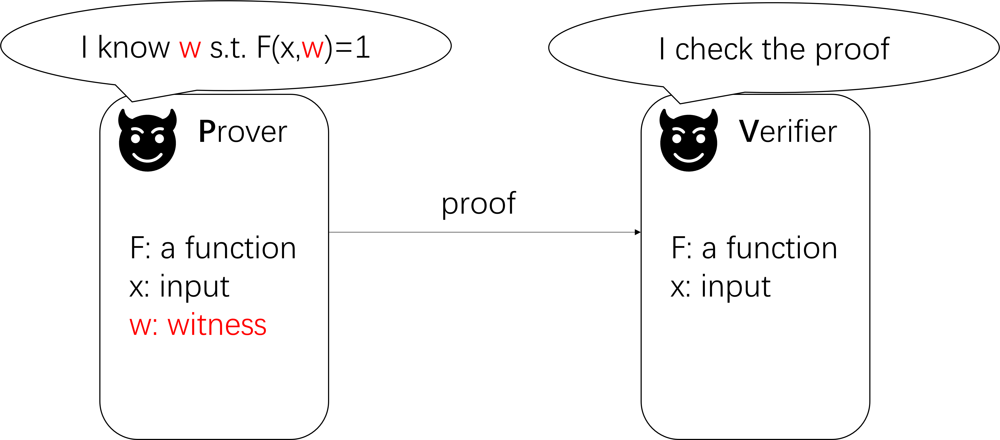
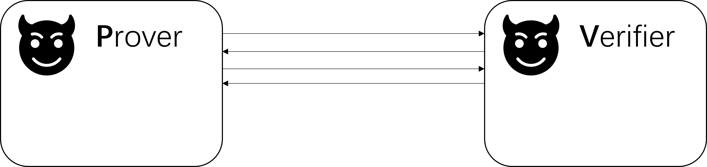
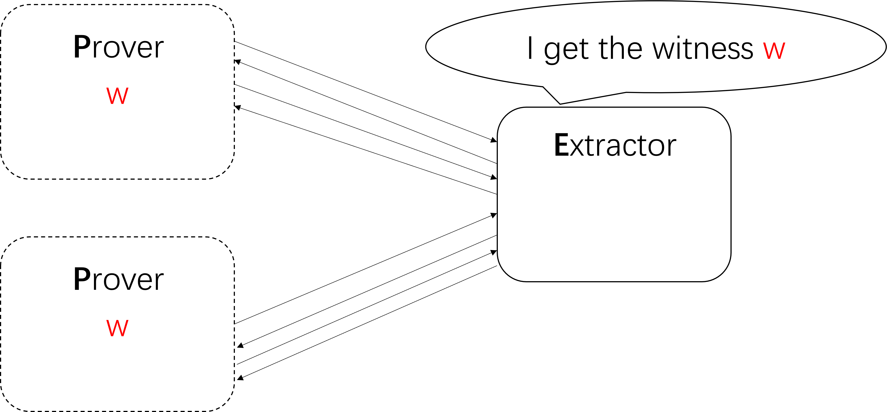
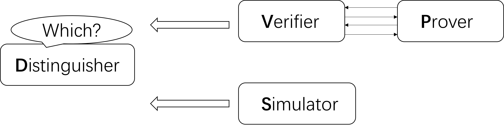
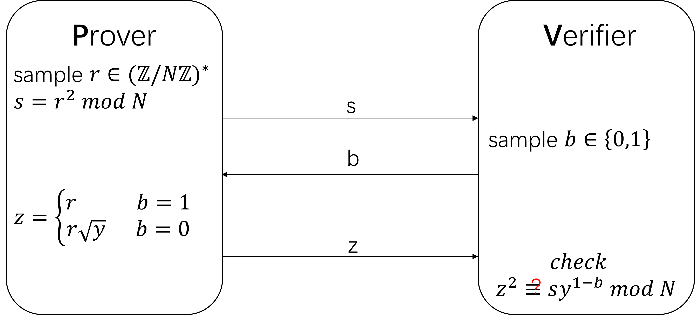
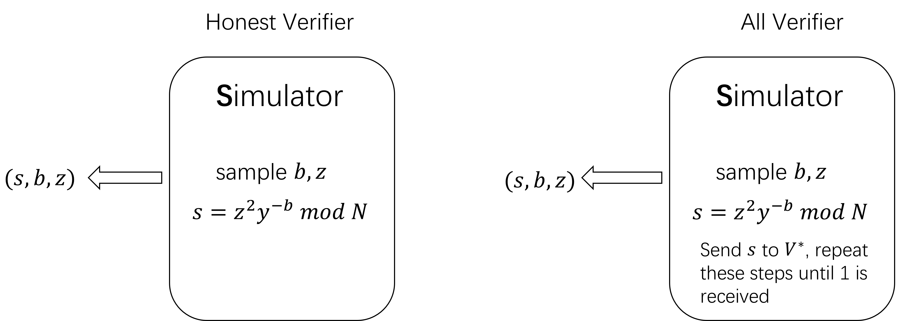
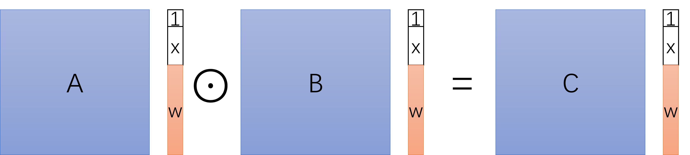
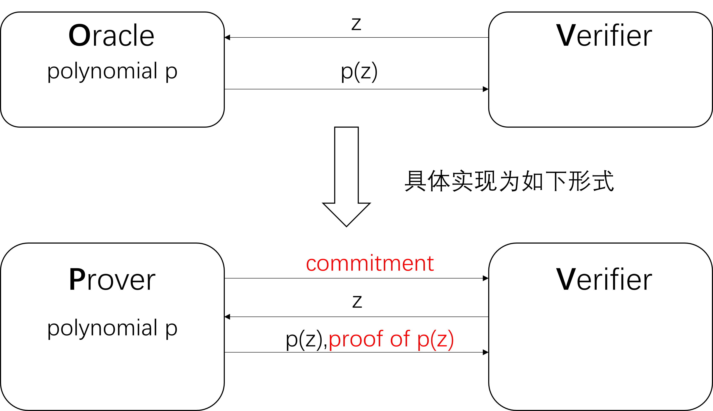
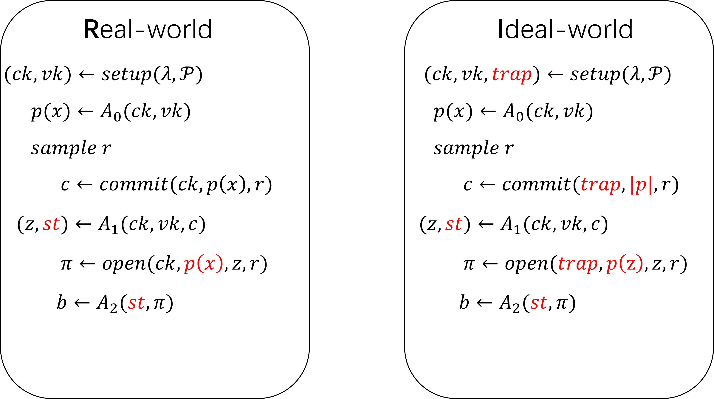

# 一、零知识证明相关的定义和例子
简明非交互式零知识证明zkSNARKs(zero-knowledge succinct non-interactive argument of knowledge)是一种具备多种性质的证明系统。本部分将从一个简单的例子引出proof的概念（argument与proof仅有细微区别，argument额外要求prover的计算能力受限），并给出对应的completeness、soundness、knowledge soundness、zero-knowledge等性质的定义，最后以二次剩余为例介绍一个证明系统。
## 1.1、直观理解proof

## 1.2、proof system的相关定义

**定义：** 如果$(P,V)$满足下面两条性质，且$V$是PPT的算法，则称$(P,V)$是针对语言$L$(可简单理解为命题成立的集合)的proof system：
+ Completeness：如果$T\in L$，则有$Pr((P,V)(T)=accept)=1$
+ Soundness：如果$T\notin L$，则对任意$P^*$ 有$Pr((P^*,V)(T)=accept)=negl(|T|)$

**定义：** 对于多项式时间的关系$R$考虑$L_R=\{x|\exists w,\ s.t.\ R(x,w)=accept \}$

## 1.3、以二次剩余为例

## 1.4、零知识证明的相关应用

# 二、zkSNARKs的构造

## 2.1、命题的描述方法与zkSNARKs的构造原理

## 2.2、polynomial commitment system
## 2.3、

|  | proving time | verification time | proof size | setup assumption |
|-------|-------|-------|-------|-------|
| Groth16（2016） | O(\|C\| log \|C\|) | O(1)(≈ 3 ms) | O(1)(≈ 200 B) | cicuit-specific trusted setup |
| Bulletproofs（2018） | O(\|C\| log \|C\|) | O(\|C\|)(≈ 3 s) | O(log \|C\|)(≈ 1.5KB) | transparent setup |
| STARK（2018） | O(\|C\| log \|C\|) | O(log² \|C\|)(≈ 10 ms) | O(log² \|C\|)(≈ 100 KB) | transparent setup |
| Plonk（2020） | O(\|C\| log \|C\|) | O(1)(≈ 3 ms) | O(1)(≈ 400 B) | universal trusted setup |